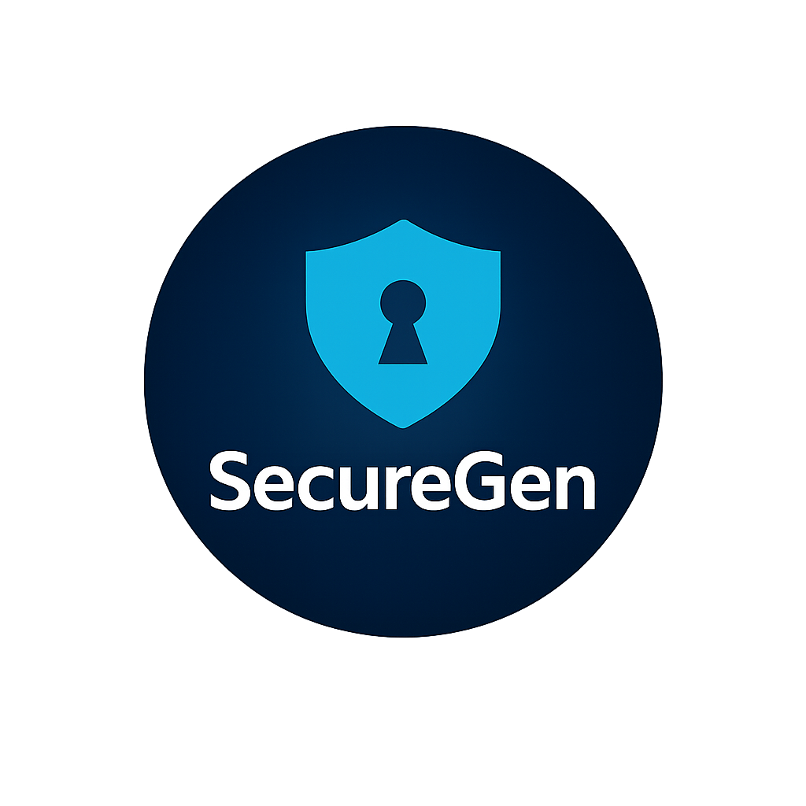
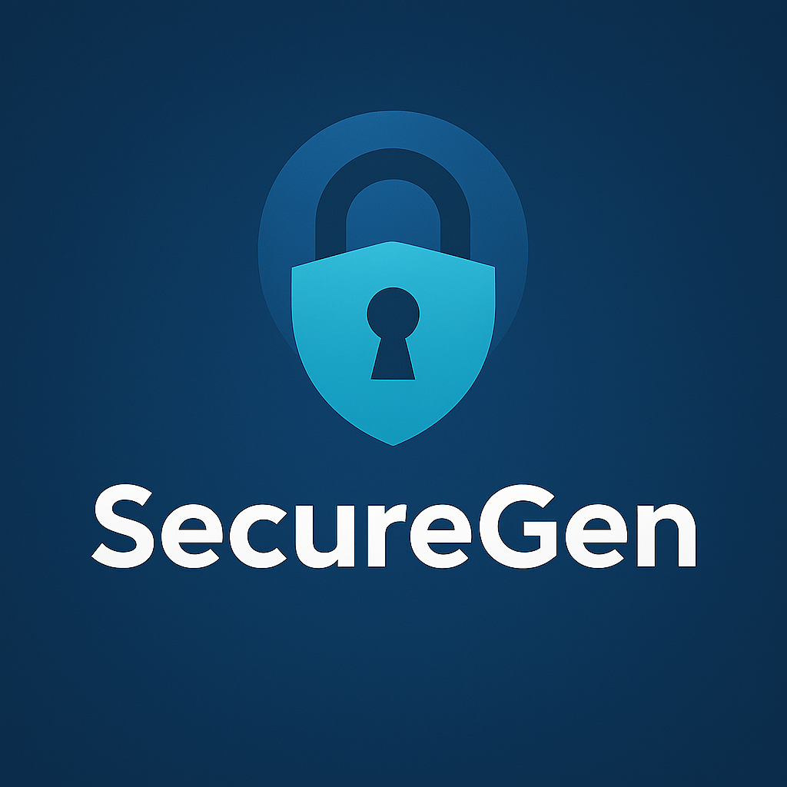

# 📄 **README.md — COMPLET**

<p align="center">
  
</p>

<p align="center">
  
</p>

<p align="center">
  <a href="https://www.powershellgallery.com/packages/SecureGen">
    
  </a>
  <a href="https://www.powershellgallery.com/packages/SecureGen">
    
  </a>
  <a href="LICENSE">
    
  </a>
</p>

---

# 🔐 SecureGen

**SecureGen** est un module PowerShell moderne, ergonomique et cross‑platform permettant de générer :

- des **mots de passe sécurisés**
- des **passphrases robustes**
- des **clés aléatoires cryptographiquement sûres**

Il est compatible **PowerShell 5.1** et **PowerShell 7+** (Windows, Linux, macOS), avec gestion automatique du **clipboard** et un **beep** discret pour confirmer la copie.

---

# 🚀 Installation

Depuis la PowerShell Gallery :

```powershell
Install-Module SecureGen -Scope CurrentUser
```

Mettre à jour :

```powershell
Update-Module SecureGen
```

Importer explicitement (facultatif) :

```powershell
Import-Module SecureGen
```

---

# 🧩 Fonctions incluses

| Fonction              | Description |
|----------------------|-------------|
| `Get-PassWord`       | Génère un mot de passe sécurisé |
| `Get-PassPhrase`     | Génère une passphrase lisible et robuste |
| `Get-CryptoIndex`    | Générateur cryptographique interne |
| `Set-ClipboardSafe`  | Copie cross-platform avec fallback |
| `Clear-ClipboardSafe`| Efface le clipboard de manière sûre |
| `Invoke-Beep`        | Feedback sonore cross-platform |

Aliases ergonomiques :

| Alias | Fonction |
|-------|----------|
| `sgp` | `Get-PassPhrase` |
| `sgw` | `Get-PassWord` |

---

# 📝 Exemples d'utilisation

## 🔑 Générer un mot de passe

```powershell
Get-PassWord
```

Avec symboles :

```powershell
Get-PassWord -Symbols
```

Copier automatiquement :

```powershell
Get-PassWord -Copy
```

---

## 🧠 Générer une passphrase

```powershell
Get-PassPhrase
```

6 mots :

```powershell
Get-PassPhrase -Words 6
```

Copier sans beep :

```powershell
Get-PassPhrase -Copy -Silent
```

---

# 🖥️ Compatibilité

| Plateforme | Support |
|------------|---------|
| Windows PowerShell 5.1 | ✔ |
| PowerShell 7+ Windows | ✔ |
| PowerShell 7+ Linux | ✔ |
| PowerShell 7+ macOS | ✔ |

Clipboard géré automatiquement via :

- Windows : `Set-Clipboard`
- macOS : `pbcopy`
- Linux : `xclip` ou `xsel`

---

# 🎨 Identité visuelle

La palette officielle SecureGen est disponible dans :

```
assets/palette.md
```

Elle inclut :

- Bleu foncé (#0A2A4F)
- Cyan vibrant (#00BCD4)
- Bleu clair (#4FC3F7)
- Gris anthracite (#263238)
- Blanc (#FFFFFF)

---

# 📦 Structure du dépôt

```
SecureGen/
│
├── src/
│   ├── SecureGen.psm1
│   └── SecureGen.psd1
│
├── assets/
│   ├── logo.png
│   ├── banner.png
│   └── palette.md
│
├── docs/
│   └── examples.md
│
├── Publish-SecureGen.ps1
├── README.md
├── CHANGELOG.md
├── LICENSE
└── .gitignore
```

---

# 📜 Licence

SecureGen est distribué sous licence **MIT**.

---

# 🤝 Contributions

Les contributions sont les bienvenues :

- Pull Requests
- Issues
- Suggestions d’amélioration

---

# ⭐ Remerciements

Merci d’utiliser SecureGen — un module conçu pour être **simple**, **sécurisé**, et **agréable à utiliser**.

---
