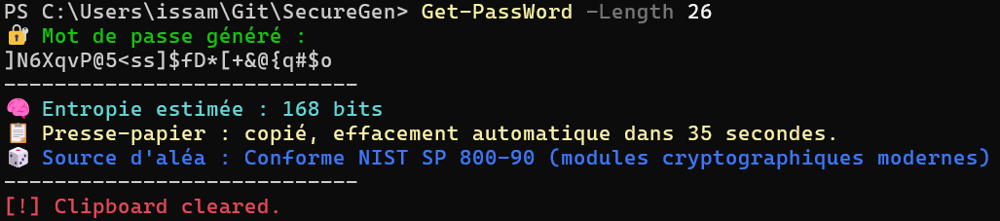
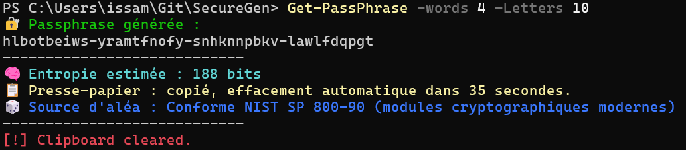

<!-- Titre principal -->
<div align="center" style="margin-top: 40px;">
  <h1 style="font-size:72px; margin-bottom: 5px;">🔐 SecureGen</h1>
</div>

<!-- Sous-titre -->
<p align="center" style="font-size: 18px; margin-top: 0; margin-bottom: 35px; color: #555;">
  <em>Modern, secure & ergonomic password generation for PowerShell</em>
</p>

<!-- Séparateur premium -->
<hr style="width: 65%; border: 0; border-top: 1px solid #e0e0e0; margin: 40px auto;">

<!-- Langues -->
<p align="center" style="margin: 30px 0;">
    <a href="README.md" style="text-decoration: none;">
        
    </a>
    <a href="README.en.md" style="text-decoration: none;">
        
    </a>
</p>

<!-- Badges PSGallery / CI / Release -->
<p align="center" style="margin: 45px 0;">

  <!-- PSGallery -->
  <a href="https://www.powershellgallery.com/packages/SecureGen" style="text-decoration: none;">
    
  </a>
  <a href="https://www.powershellgallery.com/packages/SecureGen" style="text-decoration: none;">
    
  </a>

  <!-- Compatibilité -->
  

  <!-- CI -->
  <a href="https://github.com/ledino/SecureGen/actions/workflows/ci.yml" style="text-decoration: none;">
    
  </a>

  <!-- Release -->
  <a href="https://github.com/ledino/SecureGen/releases" style="text-decoration: none;">
    
  </a>

  <!-- Dev & Quality Badges -->
  <a style="text-decoration: none;">
    
    
    
    
    
    
  </a>

</p>

<!-- Logo premium -->
<p align="center" style="margin: 60px 0 25px 0;">
  
</p>

<!-- Bannière -->
<p align="center" style="margin: 10px 0 55px 0;">
  
</p>

<!-- Ko-fi -->
<p align="center" style="margin-top: 40px; margin-bottom: 60px;">
    <a href="https://ko-fi.com/ledino_creator">
        
    </a>
</p>

---

<p align="center">

  <!-- Qualité & Maintenance -->
  
  
  

  <!-- Technologies -->
  
  

  <!-- Sécurité & Qualité -->
  
  
  

  <!-- Licence & Docs -->
  
  

</p>

---

<!-- TOC-START -->
## 📑 Table des matières

- [📘 À propos](#-à-propos)
- [⚡ Quick Start](#-quick-start)
- [✨ Fonctionnalités clés](#-fonctionnalités-clés)
- [🧩 Modes d’exécution](#-modes-dexécution)
- [🔤 Caractères spéciaux en PowerShell](#-caractères-spéciaux-en-powershell)
- [🚀 Installation](#-installation)
- [🧩 Fonctions incluses](#-fonctions-incluses)
- [📝 Exemples](#-exemples)
- [🧱 Architecture du module](#-architecture-du-module)
- [⚙️ Versioning & Releases](#️-versioning--releases)
- [📚 Documentation complète](#-documentation-complète)
- [🖼️ Screenshots](#-screenshots)
- [🗺️ Roadmap](#-roadmap)
- [🤝 Contribuer](#-contribuer)
- [💬 Support](#-support)
- [📜 Licence](#-licence)
- [⭐ Remerciements](#-remerciements)
<!-- TOC-END -->

---

# 📘 À propos

SecureGen est un module PowerShell moderne, ergonomique et cross‑platform permettant de générer :

- des **mots de passe sécurisés**
- des **passphrases robustes**
- des **secrets PKI** (Password / Passphrase + SecureString)
- des **indices cryptographiques** (Get‑CryptoIndex)

Compatible :

- **Windows PowerShell 5.1**  
- **PowerShell 7+** (Windows, Linux, macOS)

Architecture intelligente :

- **Core.PS7.ps1** → version moderne  
- **Legacy.PS5.ps1** → fallback Windows PowerShell  

---

# ⚡ Quick Start

```powershell
Install-Module SecureGen -Scope CurrentUser

Get-PassWord
Get-PassPhrase
Get-PKIPass
```

---

# ✨ Fonctionnalités clés

- 🔐 Crypto moderne (Get‑SecureRandom, RNGCryptoServiceProvider)
- 🔑 Mots de passe sécurisés
- 🧠 Passphrases robustes (Words × Len)
- 🛡️ Secrets PKI (Password / Passphrase + SecureString)
- 📋 Clipboard cross‑platform
- 🔊 Beep discret
- 🧩 Architecture modulaire PS5/PS7
- 🧪 Tests Pester + PSScriptAnalyzer
- 🚀 Pipeline de release automatisé

---

# 🧩 Modes d’exécution

SecureGen propose **4 modes d’exécution unifiés** pour :

- `Get-PassWord`
- `Get-PassPhrase`
- `Get-PKIPass`

| Mode | Affichage | Clipboard | Retour pipeline | Usage |
|------|-----------|-----------|-----------------|-------|
| **Default** | UX complète | oui | rien | interactif |
| **Quiet** | secret seul | non | secret | minimaliste |
| **Raw** | rien | non | secret | pipelines / API |
| **Silent** | rien | non | secret | scripts / CI / PKI |

### Exemples

```powershell
Get-PassWord -Quiet
Get-PassPhrase -Raw
Get-PKIPass -Silent -AsPlainText
```

---

# 🔤 Caractères spéciaux en PowerShell

PowerShell interprète certains caractères comme des opérateurs :

- `/` → chemin  
- `*` → wildcard  
- `-` → début de paramètre  
- `+` → opérateur  
- `&` → invocation  
- `_` → nom de commande  

### ✔ Solution : toujours utiliser des guillemets

```powershell
Get-PassWord -SpecialChars "/*-+&_"
```

### ❌ Mauvais

```powershell
Get-PassWord -SpecialChars /*-+&_
```

---

# 🚀 Installation

```powershell
Install-Module SecureGen -Scope CurrentUser
Update-Module SecureGen
```

---

# 🧩 Fonctions incluses

| Fonction | Description |
|---------|-------------|
| `Get-PassWord` | Génère un mot de passe sécurisé |
| `Get-PassPhrase` | Génère une passphrase robuste |
| `Get-PKIPass` | Génère un secret PKI + SecureString |
| `Get-CryptoIndex` | Générateur cryptographique interne |
| `Invoke-Beep` | Beep cross‑platform |
| `Set-ClipboardSafe` | Copie sécurisée |
| `Clear-ClipboardSafe` | Effacement sécurisé |

Alias :

| Alias | Fonction |
|-------|----------|
| `sgw` | Get-PassWord |
| `sgp` | Get-PassPhrase |
| `sgpki` | Get-PKIPass |

---

# 📝 Exemples

# 📝 Exemples

### Mot de passe

```powershell
Get-PassWord
Get-PassWord -Length 32 -Quiet
Get-PassWord -SpecialChars "/*-+&_"
```

### Passphrase

```powershell
Get-PassPhrase -Words 6 -Letters 10
Get-PassPhrase -Words 6 -Letters 10 -Separator "*"
```

### PKIPass

```powershell
# SecureString (par défaut)
Get-PKIPass -Password -Length 32

# Texte clair
Get-PKIPass -Passphrase -Words 4 -Letters 8 -AsPlainText

# Modes avancés
Get-PKIPass -Raw
Get-PKIPass -Quiet
Get-PKIPass -Silent
```

---

# 🧱 Architecture du module

```
SecureGen/
├── Core.PS7.ps1
└── Legacy.PS5.ps1
```

---

# ⚙️ Versioning & Releases

- **Conventional Commits**
- **standard-version** (automatisé dans GitHub Actions)
- **tags Git automatiques**
- **publication PSGallery automatique**

---

# 📚 Documentation complète

👉 `docs/index.md`  
👉 `docs/scripts.md`  
👉 `docs/developer-guide.md`  
👉 `docs/structure.md`

---

# 🖼️ Screenshots

<p align="center">
  
</p>

<p align="center">
  
</p>

---

# 🗺️ Roadmap

- Mode “phrase naturelle”
- Génération de clés API
- TUI minimal
- Dictionnaire multilingue
- SecureString PS7 natif
- Module “SecureGen.Tools”

---

# 🤝 Contribuer

Guides officiels :

- 🇫🇷 `docs/contributing.md`
- 🇬🇧 `docs/contributing.en.md`

---

# 💬 Support

Issues, discussions et PRs sont les bienvenues.

<p>
    <a href="https://ko-fi.com/ledino_creator">
        
    </a>
<p\>

---

# 📜 Licence

SecureGen est distribué sous licence **MIT**.

---

# ⭐ Remerciements

Merci d’utiliser SecureGen — un module conçu pour être **simple**, **sécurisé**, et **agréable à utiliser**.

---