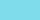
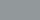

# 🎨 Palette officielle — SecureGen

Cette palette définit l’identité visuelle du projet SecureGen.  
Elle garantit une cohérence graphique dans le README, la documentation, les captures d’écran et les futures interfaces.

---

## 🎯 Couleurs principales

| Nom              | HEX        | Usage recommandé                      | Aperçu                    |
|------------------|------------|---------------------------------------|---------------------------|
| Bleu foncé       | #0A2A4F  | Logo, titres, texte principal         |        |  
| Cyan vibrant     | #00BCD4  | Accents, icônes, éléments interactifs |      |
| Bleu clair       | #4FC3F7  | Hover, sous‑titres, badges            |        |
| Gris anthracite  | #263238  | Fonds sombres, encarts techniques     |   |
| Blanc pur        | #FFFFFF  | Texte inversé, éléments lumineux      |         |

---

## 🧭 Recommandations d’usage

### 🔹 Bleu foncé (#0A2A4F)
- Couleur principale du projet  
- Utilisée pour le logo, les titres, les sections importantes  
- Idéale pour un contraste fort sur fond clair

### 🔹 Cyan vibrant (#00BCD4)
- Couleur d’accent  
- Parfait pour attirer l’attention sans être agressif  
- Utilisé dans la bannière, les icônes et les éléments interactifs

### 🔹 Bleu clair (#4FC3F7)
- Couleur secondaire  
- Idéale pour les hover, les liens, les badges  
- Apporte de la légèreté visuelle

### 🔹 Gris anthracite (#263238)
- Fond technique ou sombre  
- Parfait pour les blocs de code, encarts, sections techniques  
- Très lisible avec du texte blanc

### 🔹 Blanc pur (#FFFFFF)
- Utilisé pour les contrastes forts  
- Parfait pour les zones lumineuses ou les textes inversés

---

## 🧩 Exemples d’intégration

### Badge personnalisé

```markdown

```

### Titre stylisé

```html
<h1 style="color:#0A2A4F;">SecureGen</h1>
```

### Encadré technique

```html
<div style="background:#263238;color:white;padding:10px;border-radius:6px;">
  Exemple d'encadré technique avec la palette SecureGen.
</div>
```

---

## 📦 Notes

- Palette optimisée pour GitHub (mode clair et sombre)  
- Compatible documentation HTML, Markdown, et interfaces futures  
- Cohérente avec le logo et la bannière générés

---

## ⭐ Identité visuelle

SecureGen adopte un style **cyber minimaliste**, basé sur :
- des bleus profonds,
- des accents cyan lumineux,
- un contraste fort,
- une esthétique moderne et technique.

Cette palette est la base de toute l’identité visuelle du projet.

---
